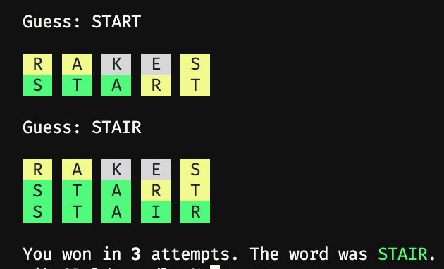

## Rordle



Rordle is a terminal [wordle](https://www.powerlanguage.co.uk/wordle/) clone written in Ruby
as a hack.

It turns out, the smartest thing about wordle is that it limits you to a puzzle a day.  You can get
totally burnt out after a few games in close succession.

## Installation

This isn't packaged up nicely as a gem:

```
git clone https://github.com/mieko/rordle.git
cd rordle
bundle
./rordle.rb
```
## The Future

This was just a hack, but I'd love PRs that do any of the following:

  - Package this as something that can be installed via `gem install`.
  - Implement the "shaded letters" indicating which letters have been used, like Wordle's keyboard
  - Time display
  - Shift words from `target5.txt` to `allow5.txt`.  This is a taste thing.
  - Limits the user to one puzzle a day.  That'd be hilarious.
  - Probably anything else.

## Implementation

Rordle provides its own curated wordlists.  It turns out you want two:

  - `target5.txt`: These are the "answer words" which rordle chooses from.  These should be ultra
    common five-letter words that no one can say *WTF?  I'VE NEVER EVEN HEARD OF THAT.*  These were
    generated from a few corpuses of "5K most common words" around the web.

  - `allow5.txt`: These are "allowed words", and there's a lot more of them.  Rordle is too easy
    and less fun when you can enter gibberish and Sudoku yourself to an answer.  Restricting to
    this keeps it a language game.  These were generated from `/usr/share/dict` and the official
    word list for a common word game you've played before.

Rordle doesn't fail you after six attempts. It uses the honor system, and trusts you'll feel like
you've lost after six attempts.

Rordle uses `readline` to give you decent editing.  So you can hit "up" to edit your last guess.

`^C` exits the game.  Entering `^D` instead of a guess exits and lets you know what the word was.
